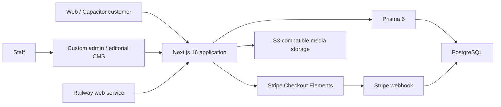
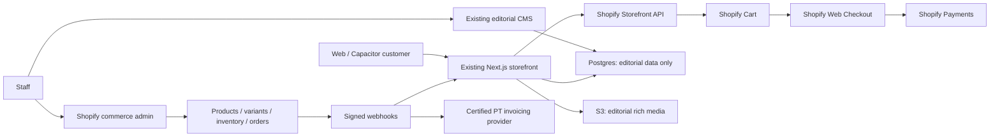

# Shopify Decision — Synarava

> Статус реализации (август 2026): фаза 1 начата. В проект добавлены переключаемая Shopify-корзина через Storefront API и переход в hosted checkout. Для активации ещё нужны Headless-токен и товары Shopify с handle, совпадающими с локальными slug.

Дата анализа: 11 августа 2026

## Решение

**Рекомендация: B — HYBRID.**

Сохранить текущий Next.js storefront, брендовые страницы, анимации, S3-медиапайплайн и небольшой editorial CMS. Использовать Shopify Basic/Grow как единственный commerce backend для каталожных вариантов, цен, остатков, cart, checkout, payments, orders, discounts, shipping и returns/refunds. Португальскую фискализацию вынести в сертифицированную систему (например, Moloni или InvoiceXpress после отдельной проверки с бухгалтером).

Не рекомендуется:

- **A — KEEP CURRENT STACK:** технически возможно, но потребует самостоятельно завершить и постоянно поддерживать наиболее рискованные части магазина: inventory concurrency, taxes, shipping, discounts, fraud, refunds, returns, reconciliation и португальскую фискализацию.
- **C — SHOPIFY-CENTRIC:** не даёт достаточной отдачи — уникальный storefront и editorial CMS уже являются заметной частью продукта, а их перенос в тему Shopify создаст новую разработку и риск потери визуального качества.
- **D — FULL SHOPIFY MIGRATION:** не оправдан текущей степенью готовности frontend/application layer и брендовой спецификой Synarava.

Уверенность в решении: **высокая (примерно 80%)**. Перед окончательным контрактным решением нужен короткий Shopify proof of concept и подтверждение фискального/платёжного контура для юридического лица в Portugal.

## Почему Hybrid лучше именно для этого проекта

Проект уже содержит самостоятельную ценность, которую Shopify не должен заменять:

- выразительный storefront на Next.js 16 / React 19;
- home, collections, product storytelling, manifesto/about и rich media;
- собственный editorial CMS для pages, collections, products, categories, tags и video;
- S3-compatible media storage и image processing;
- SEO foundation: metadata, canonical URLs, sitemap, robots и structured data;
- customer login/profile и Capacitor mobile wrapper;
- Railway deployment configuration.

Но commerce implementation пока является scaffold/MVP, а не production commerce engine:

- `ProductVariant` и `stockOnHand` существуют в Prisma, но cart хранит только `productId`, не `variantId`;
- add-to-cart использует цену и SKU уровня `Product`, не выбранного варианта;
- при изменении quantity нет проверки остатка или availability;
- checkout копирует строки cart в draft order, но не резервирует и не уменьшает stock;
- shipping, tax и discount всегда фактически равны нулю;
- нет shipping zones/rates, labels, tracking, cancellation, partial refund, return workflow и order timeline;
- webhook покрывает только успешный и неуспешный Stripe Checkout session;
- в собственном admin нет полноценного orders/inventory/fulfillment/refund backoffice;
- transactional order emails отсутствуют;
- португальская сертифицированная фактура, credit notes и AT communication отсутствуют;
- analytics/marketing attribution и production monitoring не обнаружены;
- i18n UI частично есть, но CMS прямо указывает, что BE/RU content translation ещё запланирован.

Иными словами, проект почти готов как брендовый storefront, но не как безопасная операционная система магазина.

## Текущая архитектура

| Компонент | Responsibility | Hosting / source of truth | Burden / failure impact |
|---|---|---|---|
| Next.js app | Storefront, account, admin, cart, checkout | Railway; repository | Высокий impact: падение останавливает весь customer journey |
| PostgreSQL + Prisma | Content, users, catalog, carts, orders | Railway/Postgres предполагается; точный production topology не доступен из repo | Высокий: единая БД для content и commerce |
| Custom admin | Products, collections, pages, categories, tags, video | Next.js + Postgres | Уже полезен для editorial, но commerce backoffice неполон |
| Stripe | Payment UI и processing | Stripe; order state частично в Postgres | Критичный, но lifecycle реализован лишь частично |
| S3-compatible storage | Images/video/assets | S3-compatible provider | Рабочий pipeline стоит сохранить |
| Resend HTTP integration | Только admin issue notifications | Resend | Не является transactional commerce email layer |
| Mobile | Capacitor live wrapper | App stores + тот же web application | Не отдельный commerce backend |

В repository обнаружен один `railway.json` для web deployment. Worker/cron services не обнаружены. Реальные Railway resources, PostgreSQL backups, CPU/RAM, egress, incident history и monthly bill нельзя надёжно определить из кода; их нужно экспортировать из Railway dashboard.

## Фактическая готовность функций

| Функция | Статус | Комментарий |
|---|---|---|
| Homepage / brand pages | DONE, близко к production | DB-backed editorial content и rich media |
| Product catalog / collections | DONE, needs commerce integration | Поиск/фильтры существуют; catalog source сейчас Postgres |
| Product page | DONE, needs variant UX | Сильный storytelling, но нет выбора inventory-bearing variant |
| Variants | PARTIAL / NEEDS REWORK | Schema есть; cart/admin flow практически не использует |
| Search / filters | DONE для MVP | Postgres `contains`/filters; без typo tolerance/facets engine |
| Cart | PARTIAL / NEEDS REWORK | Anonymous + authenticated persistence есть; нет variant/inventory/discount validation |
| Checkout | PARTIAL / NOT PRODUCTION READY | Shipping form + Stripe Elements; нет rates/tax/discount/fraud/abandonment operations |
| Payments | PARTIAL | Cards/Stripe possible; lifecycle и local methods не закрыты полностью |
| Inventory | NOT STARTED operationally | Только поле `stockOnHand`; нет reservation, ledger, adjustment, multi-location |
| Orders | PARTIAL / NEEDS REWORK | Draft/paid snapshots есть; нет staff operations и полного lifecycle |
| Customer accounts | PARTIAL | Login/profile/orders работают концептуально; identity migration потребует решения |
| Admin CMS | DONE для editorial | Не является полноценным commerce admin |
| Shipping | NOT STARTED | Нет zones/rates/carriers/labels/tracking |
| Discounts | NOT STARTED | Поле суммы есть, правил и codes нет |
| Refunds / returns | NOT STARTED | Есть enum labels, нет actions/provider synchronization |
| Transactional emails | NOT STARTED | В коде найден только email для admin issues |
| Invoicing / fiscalization | NOT STARTED | Критический Portugal production blocker |
| Analytics / monitoring | NOT STARTED / not found | Нет полноценного conversion/incident layer |
| SEO | DONE для MVP | Canonicals, sitemap, robots, metadata, JSON-LD присутствуют |
| Multilingual | PARTIAL | Messages/translation endpoint есть; editorial translation workflow неполон |
| Mobile UX | PARTIAL | Responsive web + Capacitor wrapper; production native configuration не доказана |

### Что осталось до первой настоящей безопасной продажи на current stack

Минимум: variant-aware cart, atomic inventory validation/reservation, shipping rates, VAT/tax validation, production Stripe methods/webhooks, idempotent order state machine, transactional email, order admin, cancellation/refund flow, certified Portuguese invoicing, monitoring/alerts и end-to-end production tests.

Можно технически провести тестовый card payment раньше, но это не равно готовности магазина к реальной продаже и последующей обработке заказа.

## Целевая Hybrid-архитектура

Ключевой принцип: Shopify интегрируется в существующий application layer; Railway и Shopify не являются взаимоисключающими альтернативами.

## Source-of-truth matrix

| Domain | Current source | Shopify possible | Final authoritative source |
|---|---|---|---|
| Products (sellable identity/status) | Postgres `Product` | Да | **Shopify** |
| Variants / SKU / price | Postgres `ProductVariant` + часть на `Product` | Да | **Shopify** |
| Inventory / availability | `ProductVariant.stockOnHand`, но не работает end-to-end | Да | **Shopify** |
| Collections membership/order | Postgres joins | Да | **Shopify** для merchandising; Postgres только narrative blocks |
| Cart | Postgres + HTTP-only cookie | Да | **Shopify Cart API** |
| Checkout | Custom pages + Stripe | Да | **Shopify Web Checkout** |
| Payments | Stripe | Да | **Shopify Payments** |
| Orders / fulfillment / refunds | Postgres | Да | **Shopify** |
| Customers | Postgres/NextAuth | Да | **Shopify Customer Accounts** для покупателей; current admin auth только для editorial staff |
| Editorial content | Postgres `Page`, rich fields/JSON | Ограниченно | **Current Postgres CMS** |
| Commerce media | S3 / URLs | Да | **Shopify** для product gallery |
| Editorial/video media | S3 | Необязательно | **Current S3 pipeline** |
| Invoices / credit notes | Отсутствует | Через integration | **Certified PT invoicing provider** |
| Search | Postgres | Да | Shopify Storefront search на MVP; отдельный index только при доказанной необходимости |

Не следует синхронизировать price/stock/orders в обе стороны. Если локальный cache Shopify данных понадобится для performance или availability, он должен быть явно read-only, rebuildable и содержать `shopify*Id`, `updatedAt`/version и timestamp последней успешной синхронизации.

## Product model mapping

| Current field/entity | Shopify equivalent | Mapping | Risk / решение |
|---|---|---|---|
| `Product.id` | Product GID | Store as `shopifyProductId` | Direct после import mapping |
| `slug` | Product handle | Direct с redirect check | Низкий SEO risk при сохранении `/products/[slug]` |
| `name` | Product title | Direct | Shopify authoritative |
| `sku` на Product | Variant SKU | Transform | Убрать SKU с product level после миграции |
| `priceCents`, `compareAtCents` | Variant price / compare-at price | Transform cents → decimal money | Shopify authoritative |
| `ProductVariant` | ProductVariant | Direct conceptually | Требуется mapping options и GIDs |
| `stockOnHand` | InventoryLevel | Transform per location | Не копировать как writable local stock |
| `inventoryPolicy` | Inventory policy | Direct | Shopify authoritative |
| `ProductOption/Value` | Options / option values | Direct | Проверить реальные комбинации size/material |
| `Collection` | Collection | Split | Shopify owns membership; current DB owns manifesto/sections |
| `ProductCollection.sortOrder` | Collection product ordering | Transform | Проверить manual ordering |
| category/tags | Product category/tags/metafields | Mixed | Нормализовать taxonomy до import |
| `description` | Product description | Direct или concise commerce copy | Long-form story оставить editorial layer |
| symbolism/material story/details JSON | Metafields/metaobjects или current editorial DB | Prefer current DB keyed by Shopify GID | Избежать перегрузки commerce model |
| primary/gallery images | Shopify product media | Import | Originals можно сохранить в S3 |
| SEO title/description | Product SEO fields | Direct | Storefront продолжает генерировать metadata |

### Jewelry-specific data

- **Variant options:** ring/bracelet size, length, finish/material только когда комбинация меняет SKU, цену или stock.
- **Metafields/metaobjects:** metal, plating, stone, pearl type, dimensions, weight, earring type, clasp, care instructions, handmade, one-of-one, limited edition, made-to-order lead time.
- **Line item/cart attributes:** engraving text, gift message, gift packaging choice — с server-side validation и переносом в order.
- **Отдельный app/custom logic:** complex product builder, dynamic engraving pricing или validation, если появятся.

Shopify поддержит текущую модель украшений без существенной потери данных, если перед импортом разделить inventory-bearing options и descriptive attributes.

## Payments, Portugal и invoicing

На 11 августа 2026 официальный Portugal pricing указывает для Basic стандартные online card rates от **1.8% + €0.30**, MB WAY **1.3% + €0.30** и third-party transaction fee **2%**. Официальный Portugal payment-method guide подтверждает cards, Apple Pay, Google Pay, Shop Pay и Multibanco; MB WAY присутствует в pricing table, но отсутствует в country help list, поэтому его реальную активацию для конкретного merchant account нужно проверить в Shopify trial admin до решения.

Shopify не закрывает Portugal invoicing автоматически: официальная документация прямо говорит, что automatic VAT invoices сейчас не поддерживаются для orders shipping to Portugal. Нужна отдельная сертифицированная интеграция. Shopify App Store описывает Moloni Portugal как интеграцию, превращающую orders в документы, сертифицированные Autoridade Tributária, с invoices, receipts и credit notes; это утверждение поставщика, поэтому юридическую пригодность и конкретный AT certificate следует подтвердить независимо.

Рекомендуемый payment/fiscal flow:

1. Shopify Checkout создаёт order и обрабатывает payment.
2. Shopify остаётся authoritative для payment/order/refund status.
3. Сертифицированная invoicing system создаёт invoice/receipt и credit note.
4. В Shopify сохраняется invoice reference/link; invoicing provider остаётся authoritative для fiscal document.
5. Ежедневный reconciliation job выявляет paid orders без invoice, refunds без credit note и расхождения totals/VAT.

Перед production запуском бухгалтер в Portugal должен подтвердить VAT режим, OSS/IOSS при необходимости, сроки выставления документов, ATCUD/QR/SAF-T(PT), credit-note process и retention.

## Shopify plan и cost model

Официальные цены Portugal на дату анализа:

- Basic: €19/month при annual billing или €27 monthly; standard cards from 1.8% + €0.30.
- Grow: €56/month annual; standard cards from 1.6% + €0.30.
- Advanced: €289/month annual; standard cards from 1.5% + €0.30.

Ниже illustrative model с AOV €100, standard domestic cards, annual billing. Он не включает VAT на услуги, Amex/international/Klarna mix, refunds, currency conversion, invoicing subscription и текущие Railway/S3/email расходы.

| Orders/month | GMV assumption | Basic | Grow | Advanced | Экономичный план |
|---:|---:|---:|---:|---:|---|
| 100 | €10,000 | ~€229 | ~€246 | ~€469 | Basic |
| 500 | €50,000 | ~€1,069 | ~€1,006 | ~€1,189 | Grow |
| 2,000 | €200,000 | ~€4,219 | ~€3,856 | ~€3,889 | Grow |

При standard-card mix Basic → Grow окупается примерно после €18,500 GMV/month. Grow → Advanced — примерно после €233,000 GMV/month, если не учитывать другие plan-specific benefits. Фактический выбор нужно пересчитывать по реальному AOV и payment-method mix.

Hybrid сохраняет текущий Railway bill. Это нормально: Shopify покупается для снижения commerce risk и operations burden, а не для замены уникального web application. Точный TCO нельзя честно посчитать без Railway invoice, Stripe effective rate, expected GMV/AOV, стоимости бухгалтерской системы и оценки internal development hour.

## Оценка разработки

Диапазоны — engineering hours для production-oriented реализации, включая code review и QA, но без ожидания merchant verification/юридических согласований.

| Вариант | Оценка | Основные работы |
|---|---:|---|
| Current stack до production | 210–390 h | Inventory/reservations, shipping/tax/discounts, order admin, fulfillment/refunds/returns, email, invoicing, security, reconciliation, E2E |
| Hybrid MVP, guest checkout | 120–200 h | Shopify setup/model/import, Storefront API, Shopify cart + redirect checkout, webhooks, invoicing, QA |
| Hybrid + Customer Accounts | 150–260 h | Плюс OIDC/Customer Account API, profile/order history migration |
| Shopify-centric | 260–480 h | Rebuild theme/storefront, content/media migration, SEO, integrations, QA |

Hybrid не является «бесплатной интеграцией», но заменяет гораздо больший объём нестандартной commerce разработки и уменьшает постоянную ответственность команды.

Ориентировочный maintenance после стабилизации:

- current custom commerce: 20–40 engineering hours/month;
- hybrid: 8–18 hours/month, включая quarterly Shopify API upgrades, webhook/reconciliation monitoring и storefront dependencies;
- Shopify-centric: 5–12 hours/month, но ценой меньшего контроля и отдельного theme/app ecosystem.

## Security и GDPR

Shopify **removes/reduces** собственную ответственность за payment form/PCI surface, checkout security, fraud primitives, inventory/order concurrency и часть customer/order operations.

Shopify **adds**:

- Storefront/Admin API credentials и scopes;
- signed webhook endpoints, replay/idempotency и reconciliation;
- customer/order PII в дополнительном processor;
- data-subject deletion/export flows между Shopify, current DB, invoicing, email и analytics providers;
- vendor/API version dependency.

Hybrid target PII map:

- Shopify: customer identity, address, cart, order, payment references;
- invoicing provider: legal customer/invoice fields и fiscal documents;
- Shopify Payments: payment data;
- current Postgres: editorial staff accounts и только минимальная customer linkage, если действительно нужна;
- email/analytics providers: минимально необходимые event/contact data.

Не дублировать полные customer addresses/orders в Postgres «на всякий случай». Если локальная аналитика требует events, хранить pseudonymous IDs и минимальные snapshots с documented retention.

## Webhook и failure architecture

Минимально подписаться на product/update, inventory level changes, orders/create/paid/cancelled/fulfilled, refunds/create и customer updates только если локальному application layer действительно нужны эти события.

Каждый webhook должен:

- проверять Shopify HMAC по raw body;
- сохранять event/topic + shop + unique delivery/event id;
- быть idempotent;
- отвечать быстро после durable enqueue/persist;
- обрабатываться с retries/dead-letter state;
- иметь logs, alerts и replay tool;
- дополняться scheduled reconciliation против Shopify Admin API.

Failure behavior:

- Shopify unavailable: cached/editorial pages могут показываться, но add-to-cart/checkout отключаются с честным сообщением; нельзя принимать локальные orders.
- Railway unavailable: storefront недоступен, но Shopify Admin/orders/fulfillment продолжают работать.
- Storefront API degraded: использовать short stale cache только для browsing; не показывать stale availability как гарантию.
- Webhook lost: reconciliation исправляет state; локальные caches никогда не становятся authoritative.
- Invoicing unavailable: paid order остаётся в Shopify, invoice job retry/alert не должен повторно списывать payment.

## SEO, performance и vendor lock-in

Hybrid позволяет сохранить текущие public URLs и избежать массовой SEO migration. `/products/[slug]` и `/collections/[slug]` остаются, а данные подменяются на Shopify Storefront API. До cutover нужно сохранить handles и создать redirect map для любых изменений.

Нельзя утверждать, что Shopify будет быстрее или медленнее без production benchmark. Для hybrid нужны server-side Storefront API calls, Next.js caching/tag invalidation, optimized media и graceful stale content. Baseline Lighthouse/RUM для home, collection, product и cart нужно снять до интеграции и повторить на pilot branch.

Vendor lock-in ограничивается тем, что presentation, routes, editorial content и S3 originals остаются нашими. Для обратимости следует:

- держать Shopify adapter за внутренним commerce interface;
- не пропускать Shopify GraphQL types по всему UI;
- хранить import/export mapping GIDs ↔ legacy IDs;
- регулярно экспортировать products/customers/orders;
- держать editorial schema независимой от Shopify metafield details;
- не внедрять Plus-only checkout customizations без доказанной бизнес-необходимости.

## План внедрения

### Phase 0 — двухнедельный proof of concept / go-no-go

1. Создать Shopify development/trial store в Portugal и проверить Shopify Payments eligibility.
2. Вручную завести 5–10 representative products: one-of-one, limited stock, size variants, made-to-order, engraving/gift attributes.
3. Подключить Storefront API из отдельного adapter module в текущем Next.js app.
4. Заменить один pilot product flow: PDP → Shopify cart → `checkoutUrl` → Shopify checkout.
5. Проверить cards, Apple Pay/Google Pay, Multibanco и фактическую доступность MB WAY.
6. Подключить sandbox/trial выбранной invoicing system; проверить paid order, cancellation, full/partial refund и credit note.
7. Измерить mobile UX и performance относительно текущего baseline.

Go только если local payment methods, invoicing и checkout branding достаточны без Plus.

### Phase 1 — commerce foundation

1. Зафиксировать Shopify как source of truth.
2. Разделить current mixed `Product` на Shopify commerce identity и local editorial extension.
3. Импортировать catalog/variants/options/media с stable mapping table.
4. Перевести product/collection reads на Storefront API с cache/revalidation.
5. Перевести cart на Shopify Cart API и checkout на Shopify web checkout.

### Phase 2 — operations

1. Настроить shipping zones/rates, taxes, discounts, notifications и policies.
2. Настроить Shopify Payments и certified invoicing.
3. Реализовать webhooks, durable event log, retry и daily reconciliation.
4. Перенести order/refund/fulfillment operations в Shopify Admin; не достраивать их в custom admin.

### Phase 3 — identity и cleanup

1. На MVP разрешить guest checkout и не блокировать запуск сложной identity migration.
2. Затем внедрить Shopify Customer Account API для profile/order history, если login приносит измеримую пользу.
3. Удалить local writes для cart/order/inventory/payment и связанные Stripe paths после production cutover и retention review.
4. Оставить current admin только для editorial content/media и staff workflows.

## Go / no-go критерии

Hybrid подтверждается, если:

- Shopify Payments доступен юридическому лицу и покрывает обязательные методы Portugal;
- invoicing integration создаёт корректные certified invoices/receipts/credit notes и проходит проверку бухгалтера;
- product variants/metafields покрывают реальные jewelry cases;
- checkout branding приемлем без Shopify Plus;
- pilot не ухудшает критично mobile conversion UX/Core Web Vitals;
- команда принимает Shopify как единственный commerce source of truth.

Остаться на current stack стоит только если PoC обнаружит блокирующую бизнес-логику checkout/product customization, которую нельзя реализовать без Plus или стороннего app, и её коммерческая ценность доказанно выше стоимости собственной commerce платформы.

## Проверки repository

- `pnpm lint`: 0 errors; warnings в основном идут из vendored skill scripts, плюс две project warnings.
- `pnpm test:run`: 278/281 tests passed; 3 failures в `ThemeScript` tests. Commerce component tests в основном unit/UI; полноценного order/payment/inventory E2E покрытия не обнаружено.
- `pnpm build`: compilation и TypeScript прошли; route generation завершился. Локальная PostgreSQL на `127.0.0.1:55432` не была запущена, поэтому Prisma fallback paths логировали connection errors во время static generation.
- Production runtime, real payment, Railway health/costs и Core Web Vitals этим repository-only аудитом не подтверждены.

## Sources

- [Shopify Portugal pricing](https://www.shopify.com/pt/precos)
- [Shopify Storefront API for headless storefronts](https://shopify.dev/docs/storefronts/headless/building-with-the-storefront-api/index)
- [Shopify Cart API and checkout URL](https://shopify.dev/docs/storefronts/headless/building-with-the-storefront-api/cart/manage)
- [Shopify Customer Account API](https://shopify.dev/docs/api/customer/latest)
- [Shopify Payments methods in Portugal](https://help.shopify.com/en/manual/payments/shopify-payments/supported-countries/portugal/payment-methods)
- [Shopify Multibanco requirements](https://help.shopify.com/en/manual/payments/shopify-payments/local-payment-methods/multibanco)
- [Shopify Markets](https://help.shopify.com/en/manual/markets)
- [Shopify VAT invoices: Portugal limitation](https://help.shopify.com/en/manual/taxes/shopify-tax/vat-invoices)
- [Autoridade Tributária: certified invoicing software](https://info.portaldasfinancas.gov.pt/pt/apoio_ao_contribuinte/Negocios/Faturacao/Regras_mecanismos_comunicacao/Certificacao_programas/Certificacao_software_faturacao/Paginas/default.aspx)
- [Moloni Portugal listing in Shopify App Store](https://apps.shopify.com/moloni-portugal?locale=pt-PT)

## Final answer

**Shopify проекту нужен, но не как новый сайт.** Он нужен как зрелое commerce ядро под уже созданным Synarava experience. Лучшее соотношение скорости запуска, операционного риска, стоимости и сохранения бренда даёт текущий Next.js/Railway storefront + Shopify Storefront Cart/Checkout/Payments/Admin + certified Portuguese invoicing integration.
