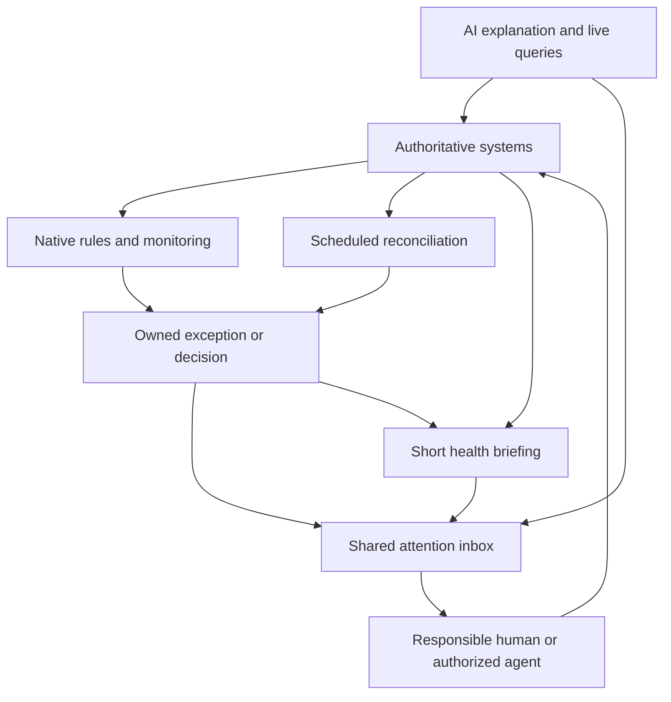

# Операционная инфраструктура Synarava

Статус: стратегический рабочий документ 
Дата исследования: 4 октября 2026 года 
Юрисдикция: Португалия, Европейский союз

## Назначение документа

Этот документ фиксирует стратегию построения операционной инфраструктуры нового e-commerce-бизнеса Synarava. Его цель — создать компанию, которую легко понимать, контролировать, автоматизировать и делегировать по мере роста.

Документ намеренно не начинается со списка программ. Сначала определена операционная модель, затем рассмотрены разные архитектуры и только после этого выбрана рекомендуемая комбинация инструментов.

Исходные обязательства:

- Shopify — commerce и e-commerce.
- Google Workspace Business Starter — почта и документы.
- Railway — хостинг и инфраструктура.
- GitHub — исходный код и процесс разработки.
- Существующий storefront остается и не подлежит замене без конкретной причины.
- Система португальской бухгалтерии и фискального инвойсинга пока не выбрана.
- Планируемые маркетинговые каналы: Facebook, Instagram и TikTok.

Целевой пользователь на первом этапе — основатель. Целевое состояние:

> За 30 секунд понять, здоров ли бизнес, что сломано, что требует внимания и где необходимо решение.

## Главный вывод

Основная проблема — не фрагментация приложений сама по себе, а **операционная неопределенность**. Состояние компании хранится в разных системах, а связи между событиями, обязательствами, ответственностью и следующими действиями существуют в голове основателя.

Дашборд может красиво показать эту неопределенность, но не устранить ее. AI может пересказать доступные данные, но не гарантировать полноту контроля. Общий inbox может собрать сигналы, но без владельцев и правил превратится в новый шумный список.

Поэтому инфраструктура должна обеспечивать три свойства:

1. У каждого важного процесса есть владелец и формальное определение нормального состояния.
2. Исключения становятся долговечной работой: у них есть доказательства, владелец, состояние, срок и условие закрытия.
3. Отсутствующие или устаревшие данные видимы. Молчание системы не считается доказательством здоровья.

Рекомендация: сохранить текущие базовые системы, добавить португальский фискальный контур, единый inbox внимания и небольшое количество управляемых автоматизаций и мониторов. AI сначала объясняет и помогает обрабатывать уже выявленные исключения, а затем получает контролируемый доступ к живым системам.

До запуска не следует строить собственный ERP, универсальный дашборд или автономную платформу агентов.

## Три операционных ритма

| Ритм | Назначение | Примеры | Как доходит до человека |
|---|---|---|---|
| Немедленный | Предотвратить существенный ущерб | checkout недоступен, security incident, упала интеграция fulfillment | Срочное уведомление и incident |
| Ежедневный | Не дать работе застрять | заказ просрочил отправку, клиент ждет ответа, отсутствует invoice | Приоритетная очередь и короткий briefing |
| Еженедельный/ежемесячный | Управленческие решения | маржа, эффективность рекламы, cash forecast, поставщики, закрытие периода | Регулярный review с подготовленными данными |

Первый экран должен отвечать на пять вопросов:

- Сломано ли сейчас что-то существенное?
- Есть ли забытые клиенты или заказы?
- Приближается ли обязательство или срок?
- Какие решения может принять только основатель?
- Насколько свежа и полна эта оценка?

Revenue, traffic, ROAS и другие KPI поддерживают этот обзор, но не должны вытеснять реальные обязательства и риски.

## Ключевые принципы

### Одно место не означает одну базу данных

Нужна единая точка входа для внимания. Расследование и исполнение могут открывать Shopify, бухгалтерскую систему, Railway или другой источник истины.

### Уведомление не является работой

Уведомление исчезает. Исключение должно иметь:

- стабильный ID;
- ссылку на источник;
- описание влияния;
- одного ответственного;
- состояние;
- следующее действие;
- срок;
- правило эскалации;
- проверяемое условие закрытия.

### Автоматизация создает новые режимы отказа

Каждую автоматизацию нужно мониторить. Она должна поддерживать повторную обработку, защиту от дублей, reconciliation и отдельный сигнал о собственной неисправности.

### AI не заменяет бизнес-правила

Вопрос «какие заказы застряли?» невозможно надежно решить без обещанного срока отправки, правил preorder, payment state, warehouse owner и качественных timestamps.

### Опыт основателя должен меняться по мере роста

Сегодня основатель видит большую часть операционной работы. Позже он должен видеть только существенные риски, просроченные эскалации и решения за пределами полномочий команды.

## Что реально консолидируют разные категории систем

| Подход | Что он консолидирует | Что остается снаружи |
|---|---|---|
| Commerce-платформа | Заказы, товары, commerce workflows, merchant analytics | Португальский fiscal compliance, расходы, engineering, общий management |
| Shared inbox | Коммуникацию, assignment, follow-up, system exceptions | Транзакционную обработку и сложные специализированные процессы |
| Business suite | Support, проекты, документы, marketing, administration, identity | Существующие commerce и engineering системы, локальные fiscal gaps |
| ERP | Purchasing, stock, warehouse, финансовые и операционные транзакции | Часть customer, marketing и engineering задач |
| AI workspace | Поиск, объяснение, briefing и действия через tools | Источники истины, надежный monitoring, ownership и enforcement |

### Shopify как commerce core

Shopify покрывает больше, чем storefront и checkout. Shopify Flow поддерживает scheduled checks, включая просроченные unfulfilled orders. Sidekick работает с commerce-контекстом и может предлагать действия в desktop/mobile интерфейсе.

Это делает Shopify сильным commerce core, но не операционной системой всей компании.

Источники:

- [Shopify Flow: scheduled workflows](https://help.shopify.com/en/manual/shopify-flow/advanced-workflows/examples)
- [Shopify Sidekick](https://help.shopify.com/en/manual/ai-powered-tools/sidekick)
- [Shopify Portugal pricing](https://www.shopify.com/pt/precos)

### Shared inbox как интерфейс внимания

Для начального состояния shared inbox полезнее собственного дашборда. Missive особенно релевантен из-за Mac/mobile приложений, shared communication, assignment, tasks, rules, API, Shopify integration и AI.

Он может стать местом, которое основатель открывает утром, а затем — интерфейсом работы нескольких команд.

Источники:

- [Missive pricing](https://missiveapp.com/pricing)
- [Missive integrations](https://missiveapp.com/docs/advanced-features/integrations)
- [Missive API](https://missiveapp.com/docs/developers/rest-api/)
- [Missive AI assistant](https://missiveapp.com/docs/ai/using-ai/assistant)
- [Front customer operations](https://front.com/product)

### Business suite

Zoho One может объединить support, projects, marketing, HR и administration. Это сильный вариант, когда нескольким новым отделам одновременно требуются системы.

Сейчас он дублировал бы часть Google Workspace и добавил бы значительную настройку до появления команды. All-employee licensing также становится существенным при росте штата.

Источники:

- [Zoho One](https://www.zoho.com/one/)
- [Zoho One licensing FAQ](https://www.zoho.com/one/pricing/faq.html)

### ERP

ERP становится полезен, когда главной проблемой становится координация purchasing, stock, warehouses, fulfillment и accounting transactions.

Odoo — наиболее значимый managed-кандидат из рассмотренных. External API и multi-company требуют соответствующего плана. Наличие Portuguese localization — полезный сигнал, но не доказательство полного соответствия конкретной конфигурации требованиям Португалии.

Источники:

- [Odoo pricing](https://www.odoo.com/pricing)
- [Odoo fiscal localizations](https://www.odoo.com/documentation/19.0/applications/finance/fiscal_localizations.html)
- [ERPNext Portugal extension](https://cloud.frappe.io/marketplace/apps/erpnext_portugal)

### AI workspace

Dust, Notion Custom Agents и AI внутри work interface показывают, что разговорный интерфейс к компании уже реалистичен. Он становится полезным после появления качественных источников, permissions и проверяемых действий.

Источники:

- [Dust pricing and capabilities](https://dust.tt/home/pricing)
- [Notion Custom Agents](https://www.notion.com/help/custom-agents)
- [Missive MCP integrations](https://missiveapp.com/docs/ai/mcp/integrations)

### Важная рыночная проверка

Relay.app присутствует в старых документах и поисковой выдаче, но его текущая страница сообщает, что сервис закрылся в сентябре 2026 года. Это аргумент в пользу экспорта конфигураций и exit plan даже для удобного automation SaaS.

- [Relay shutdown notice](https://relay.app/)

## Португалия и ЕС: обязательный контур

### Четыре разных финансовых объекта

Нужно различать:

1. Commerce order.
2. Payment, settlement, fee и refund.
3. Fiscal invoice и корректирующие документы.
4. Accounting entry и supporting evidence.

Shopify order confirmation или payment receipt не доказывают, что португальский fiscal invoice корректно создан и передан.

### Португальский sales invoicing

До первой реальной продажи следует выбрать подходящее сертифицированное решение и вместе с португальским contabilista подтвердить:

- VAT/IVA regime компании;
- document series;
- ATCUD;
- QR requirements;
- communication to AT;
- порядок credit notes и возвратов;
- SAF-T/export и handoff в accounting.

AT указывает, что данные выпущенных документов обычно должны быть сообщены до 5-го числа следующего месяца. Исключительные изменения сроков должны жить в календаре обязательств, а не в памяти основателя.

Источники:

- [AT invoicing rules](https://info.portaldasfinancas.gov.pt/pt/apoio_ao_contribuinte/Negocios/Faturacao/Regras_de_faturacao/Paginas/default.aspx)
- [ATCUD and document series](https://info.portaldasfinancas.gov.pt/pt/apoio_contribuinte/questoes_frequentes/pages/faqs-00883.aspx)
- [AT invoice communication deadline](https://info.portaldasfinancas.gov.pt/pt/faturas/Pages/faqs-00978.aspx)

### NIF и документы поставщиков

Автоматическая проверка входящих документов должна отмечать:

- неверную компанию-покупателя или NIF;
- отсутствие invoice number/date;
- несогласованные суммы, currency или tax information;
- duplicate document;
- payment без supporting document;
- случаи, требующие решения бухгалтера.

Автоматизация не должна сама объявлять VAT deductibility или придумывать налоговое основание. У иностранного SaaS invoice может законно отсутствовать португальский IVA.

VIES следует использовать для проверки применимых EU business VAT numbers и сохранять evidence проверки. Проверка VIES отличается от проверки формата португальского NIF.

Источники:

- [CIVA Article 36](https://info.portaldasfinancas.gov.pt/pt/informacao_fiscal/codigos_tributarios/civa_rep/pages/iva36.aspx)
- [EU VIES guidance](https://europa.eu/youreurope/business/finance-and-tax/vat/check-vat-number-vies/index_en.htm)

### Архивирование

Португальские правила в общем случае требуют хранить книги, записи и supporting documents 10 лет, если специальная норма не требует иного. Электронный архив имеет дополнительные требования. Размещение фискального архива за пределами ЕС может создавать отдельный вопрос согласования с AT.

Поэтому папка в Drive может быть удобным рабочим storage, но не должна автоматически считаться полным compliant fiscal archive.

Источники:

- [Decree-Law 28/2019](https://diariodarepublica.pt/dr/detalhe/decreto-lei/28-2019-119622094)
- [AT archive-location guidance](https://info.portaldasfinancas.gov.pt/pt/destaques/Paginas/DL28_2019.aspx)

### EU cross-border sales и OSS

Порог €10,000 относится к совокупным qualifying cross-border B2C distance sales и некоторым услугам в ЕС при выполнении условий, а не к отдельному порогу для каждой страны.

При необходимости destination VAT и Union OSS позволяют подавать соответствующую отчетность через Member State of Identification. OSS returns не заменяют domestic VAT return.

Перемещение stock в зарубежный warehouse необходимо проверять до перемещения товара: OSS не закрывает автоматически все возможные local VAT obligations.

- [European Commission OSS guidance](https://vat-one-stop-shop.ec.europa.eu/one-stop-shop_en)

### Consumer law и complaints

Нужны отдельные процессы для:

- withdrawal/right of free resolution;
- defective goods и legal guarantee;
- discretionary goodwill;
- formal complaint.

В Португалии для distance purchases в общем случае действует 14-дневное право отказа с исключениями, а для новых movable consumer goods — трехлетняя legal guarantee. Это разные права и разные процессы.

Livro de Reclamações Eletrónico должен поступать в отдельный formal-complaint workflow. Для электронной жалобы применяется 15-working-day response obligation; сроки нужно вычислять по применимому календарю и сохранять evidence ответа.

Старые website templates могут содержать устаревшую ссылку на EU ODR platform: платформа прекращена в июле 2025 года.

Источники:

- [Portuguese consumer guarantee guide](https://www.gov.pt/guias/garantia-de-produtos-comprados-em-portugal)
- [Livro de Reclamações operator obligations](https://www.cm-palmela.pt/cmpalmela/uploads/writer_file/document/8703/regjur_livroreclamacoes.pdf)
- [EU ODR repeal regulation](https://eur-lex.europa.eu/legal-content/EN/TXT/HTML/?uri=CELEX%3A32024R3228)

### Privacy и product obligations

Нужно обеспечить:

- processor agreements;
- контролируемый доступ;
- purpose-specific retention;
- правила international transfers;
- consent control для применимого tracking;
- incident process для personal-data breach.

Рискованный breach может требовать notification supervisory authority в течение 72 часов с момента awareness.

Для физических товаров нужны supplier/product traceability и safety information. GPSR регулирует product safety и информацию в online offer. Для packaging требуется проверка применимости Portuguese producer responsibilities.

Для jewelry из precious metals действуют отдельные правила Contrastaria и distance selling. В частности, online offer должен содержать сведения о металле, пробе, весе, маркировке и предусмотренные ссылки/уведомления.

Источники:

- [EU GDPR guidance](https://europa.eu/youreurope/business/governance-and-sustainability/digital-and-data-compliance/data-protection-gdpr/index_en.htm)
- [EU cookie guidance](https://europa.eu/youreurope/business/growing/digitalising/online-privacy/index_en.htm)
- [GPSR summary](https://eur-lex.europa.eu/EN/legal-content/summary/general-product-safety-regulation-2023.html)
- [APA producer registration](https://apambiente.pt/residuos/registo-de-produtores-de-produtos)
- [ASAE precious-metal distance sales](https://www.asae.gov.pt/perguntas-frequentes1/area-economica/rjoc/comercializacao-de-artigos-com-metal-precioso.aspx)

## Португальский invoicing: рекомендуемый кандидат

Предпочтительный кандидат — **Moloni Flex**, при условии прохождения acceptance test и подтверждения contabilista.

Почему:

- интеграция с Shopify;
- API/e-commerce capabilities;
- purchasing records;
- SAF-T и AT communication;
- доступная стоимость;
- mobile access;
- заявленная AT certification №2860.

Альтернативы для сравнения: InvoiceXpress, Cegid Vendus и TOConline, особенно если выбранный бухгалтер уже организует intake и reconciliation через TOConline.

Источники:

- [Moloni plans](https://www.moloni.pt/planos/index.php)
- [Moloni certification claim](https://www.moloni.pt/registo/)
- [Moloni Shopify app](https://apps.shopify.com/moloni-portugal?locale=pt-PT)
- [InvoiceXpress Shopify integration](https://invoicexpress.com/blog/vender-online-shopify-faturar)
- [Vendus Shopify integration](https://www.vendus.pt/ajuda/como-ativar-a-integracao-com-a-shopify/)
- [TOConline capabilities](https://www.occ.pt/tocoline_landing_page/toconline-lp.html)

Независимо получить актуальную запись Moloni в реестре AT во время исследования не удалось из-за недоступности реестра. Это остается обязательным pre-launch check.

### Критические acceptance tests

- Purchase без NIF.
- Purchase с корректным запрошенным NIF.
- Некорректный введенный NIF должен создать visible exception, а не молча потерять запрос клиента.
- Shipping, discounts, rounding и VAT.
- Все используемые payment states.
- Cancel до invoicing.
- Full refund.
- Partial refund.
- Credit note и payment return.
- Duplicate/replayed event.
- Customer document delivery.
- SAF-T/accounting export.
- Исправление документа с audit trail.
- Отсутствие конкурирующих stock writers.

Документация Moloni указывает, что invalid NIF может быть заменен на consumer-final identifier. Это поведение нельзя принимать вслепую.

- [Moloni NIF configuration](https://www.moloni.pt/suporte/como-configurar-o-campo-contribuinte-no-shopify)
- [Moloni stock synchronization](https://www.moloni.pt/suporte/moloni-e-shopify-sincronizacao-de-stocks)
- [Moloni credit/payment return](https://www.moloni.pt/suporte/para-que-servem-as-devolucoes-de-pagamento)

Shopify Bill Pay и Balance не являются решением для португальской компании: соответствующие функции ограничены США.

- [Shopify Bill Pay](https://help.shopify.com/en/manual/finance/shopify-bill-pay)
- [Shopify Balance eligibility](https://help.shopify.com/en/manual/finance/shopify-balance/eligibility)

## Пять стратегий

Оценки стоимости ниже — дополнительные planning allowances сверх уже оплачиваемой базовой инфраструктуры. Они не включают IVA, accountant fees, payment fees, shipping, ads и существенный AI usage.

### A. Native platforms + минимальная координация

Каждая source system управляет своим доменом. Gmail получает важные alerts и daily digest.

- Daily experience: прочитать digest и открыть нужную систему.
- Mobile: хороший, но контекст распределен.
- Automation: native rules.
- Delegation: слабая для cross-functional work.
- Implementation: 1–3 дня.
- Initial cost: примерно €15–50/month.
- Growth cost: примерно €100–350/month.
- Maintenance: низкий на старте, затем растет.
- Scaling limit: ownership и handoffs.
- Survives: source systems и native monitoring.
- Replaced later: email-label coordination.

### B. Shared attention inbox + распределенные records — рекомендация

Records остаются в source systems; human attention и coordination централизуются в Missive. Make используется только для небольшого количества cross-system workflows.

- Daily experience: briefing + personal/team action queue.
- Mobile: triage, assignment, approvals и replies.
- Automation: native first, Make where cross-system.
- Alert model: actionable exceptions, grouped incidents, digests.
- AI: email/document context, drafts, explanation, позже live queries.
- Delegation: queues принадлежат support/operations/finance/engineering.
- Security: source-system permissions + scoped inbox access.
- Implementation: 3–5 дней.
- Initial cost: примерно €50–100/month.
- Growth cost: примерно €200–600/month.
- Maintenance: low to moderate.
- Lock-in: workflow configuration, но core records остаются независимыми.
- Scaling limit: advanced support, warehouse execution, portfolio planning.
- Survives: attention model, ownership, source architecture, briefing.

### C. Business-suite consolidation

Большинство non-commerce функций стандартизируются внутри Zoho One или аналогичного suite.

- Daily experience: suite home/work queue.
- Mobile: множество модулей, но общая admin layer.
- Automation/AI: сильны внутри ecosystem.
- Delegation: strong role and app administration.
- Implementation: 3–5 дней для узкого scope; дольше для полного внедрения.
- Initial allowance: €60–150/month.
- Growth allowance: €300–900/month.
- Maintenance: moderate.
- Lock-in: высокий по workflows, support, docs и marketing.
- Scaling limit: specialist commerce/inventory/fiscal needs.
- Подходит, когда нескольким отделам одновременно нужны системы.

### D. ERP/process consolidation

Purchasing, inventory, warehouse и administrative transactions переходят в единый process model.

- Daily experience: process activities и operational exceptions.
- AI: более целостная transaction model.
- Delegation: сильная через roles, approvals и audit trails.
- Implementation: узкий prototype возможен за дни; надежное внедрение обычно занимает недели.
- Initial allowance: €100–300/month плюс implementation.
- Growth allowance: €500–1,500+/month.
- Maintenance: moderate/high.
- Lock-in: высокий.
- Migration risk: высокий для stock/financial cutover.
- Подходит, когда transaction coordination становится главной проблемой.

### E. AI-first operating interface

Основатель спрашивает агента о состоянии бизнеса; agent делает briefing, предлагает действия и запрашивает approvals.

- Daily experience: conversational briefing и exception resolution.
- Data stays distributed.
- Automation: agents + deterministic monitors.
- Delegation: role-specific agents и permission boundaries.
- Implementation: 2–5 дней для read-only; safe actions дольше.
- Initial allowance: €60–180/month.
- Growth allowance: €300–1,200+/month.
- Maintenance: moderate/high.
- Reliability: недостаточна как единственный контрольный механизм.
- Scaling limits: connector coverage, permissions, auditability и confidence.
- Это целевое направление развития, но не launch foundation.

### Сравнительные оценки

10 — лучший результат. В строке Cost 10 означает наименьшую совокупную стоимость.

| Criterion | A Native | B Attention inbox | C Suite | D ERP | E AI-first |
|---|---:|---:|---:|---:|---:|
| Simplicity | 9 | 8 | 6 | 4 | 6 |
| Speed to implement | 10 | 9 | 6 | 3 | 7 |
| Cost | 10 | 8 | 7 | 4 | 6 |
| Reliability | 8 | 8 | 8 | 8 | 5 |
| Mobile UX | 8 | 9 | 7 | 6 | 7 |
| Automation | 6 | 8 | 9 | 9 | 9 |
| AI readiness | 6 | 8 | 8 | 8 | 10 |
| Delegation | 4 | 9 | 9 | 9 | 6 |
| Scalability | 6 | 8 | 8 | 10 | 7 |
| Maintainability | 9 | 8 | 7 | 5 | 5 |

## Рекомендуемая архитектура

### Источники истины

| Информация | Authority now | Что получает центральный интерфейс |
|---|---|---|
| Products, variants, commerce orders | Shopify | Exceptions, summaries, source links |
| Synarava editorial content | Existing site/CMS | Publication issues и content work |
| Online sellable stock | Shopify initially | Shortage, discrepancy, replenishment exceptions |
| Dispatch/tracking | Fulfillment provider/carrier | Late/unaccepted/delivery exceptions |
| Payment attempts/refunds | Payment provider + Shopify integration | Failures, disputes, reconciliation exceptions |
| Settled cash | Bank | Cash snapshot, unusual charge, unmatched transaction |
| Fiscal documents | Portuguese invoicing system | Missing/failed/correction work |
| Accounting ledger | Accountant’s system | Close status, missing evidence, reports |
| Customer cases | Shared inbox | Сам case |
| Procedures/documents | Company-owned Workspace | Links and approved indexed knowledge |
| Subscriptions/obligations | Structured register initially | Renewals, deadlines, price variance |
| Code/dev work | GitHub | Failed checks, security alerts, incidents |
| Deployments/runtime | Railway + monitoring | Failed deploys, outage, current version |
| Advertising | Meta/TikTok platforms | Budget/delivery exceptions |
| Management metrics | Defined calculations | Briefing and periodic analysis |

### Структура shared inbox

Первоначально достаточно четырех responsibility areas:

- Customers.
- Operations.
- Finance.
- Technology.

Отдельный founder view показывает decisions и material escalations. Не следует создавать десять виртуальных отделов для одного человека.

Состояния работы:

- Open.
- In progress.
- Waiting — всегда с датой следующей проверки.
- Resolved — только после проверки underlying condition.

Development work остается в GitHub. Customer-reported bug связывается с engineering issue, но customer conversation закрывается только после выполнения обязательства перед клиентом.

### 30-second briefing

Пример:

> **Attention needed — updated 08:30 Lisbon** 
> Website и checkout probes прошли. Current production version: ссылка на release. 
> Два заказа просрочили dispatch promise; оба назначены Operations. 
> Один клиент превысил response target. 
> Три expense payments не имеют документов; reconciliation актуален на вчера. 
> Одно renewal decision необходимо до пятницы. 
> Yesterday: orders, net sales excluding IVA, advertising spend. 
> **Unknown:** TikTok connection failed; advertising assessment incomplete.

Briefing должен отображать:

- last successful observation;
- data freshness;
- coverage gaps;
- открытые исключения;
- владельцев;
- decisions.

Failure briefing job должен обнаруживаться независимым heartbeat monitor.

### Notification policy

- Immediate: outage, credible security incident, urgent statutory deadline, severe payment/integration issue.
- Same-day queue: overdue customer и fulfillment work.
- Digest: renewal, missing documents, ordinary management decisions.
- Silence: successful order, deployment, invoice и routine stock update.

Один сломанный connector, создавший 40 missing documents, должен давать один incident со списком затронутых records, а не 40 founder alerts.

## Начальные detection rules

| Процесс | Starting rule | Owner/action |
|---|---|---|
| Dispatch | Paid, fulfillable order превышает promised dispatch time; preorder/hold исключены | Operations |
| Fulfillment integration | Eligible order не принят provider в согласованный срок | Operations incident |
| Customer response | First response или promised follow-up overdue | Support |
| Refund | Approved refund не завершен по payment/fiscal/return workflow | Support + Finance |
| Sales invoicing | Order требует fiscal document, но подтвержденного document нет | Finance |
| Expense evidence | Posted expense не имеет документа после grace period | Finance |
| Subscription variance | Comparable vendor charge materially changed | Subscription owner review |
| Renewal | Approaching cancellation/renewal deadline | Named owner |
| Storefront | Repeated external readiness failure | Engineering incident |
| Checkout | Cart-to-checkout probe fails | Engineering urgent after confirmation |
| Deployment | Build/deploy/smoke test fails | Engineering |
| Automation | Failed run, expired connection, backlog, missed heartbeat, quota risk | Automation owner |
| Advertising | Hard budget breach, disapproval или delivery interruption | Marketing |
| Management | Decision/blocked process deadline expired | Accountable owner |

### Payments

Обычный card decline не является incident. Нужны alerts на:

- technical failure;
- repeated gateway error;
- abnormal failure rate с достаточной выборкой;
- dispute/chargeback;
- overdue settlement.

При малом объеме продаж отсутствие заказа несколько часов не является надежным сигналом поломки.

### Advertising

До накопления истории нужно контролировать budgets, disapprovals, broken delivery и tracking. Позже можно добавлять anomaly detection с учетом sample size, attribution lag, seasonality и channel mix.

### Technology

Railway healthcheck проверяет deployment readiness, но не является continuous uptime monitoring. Нужен внешний runtime check.

Начальный выбор — Sentry для errors, release context и доступных uptime/cron checks. Better Stack добавляется только при реальной потребности в дополнительных probes, delivery channels или incident escalation.

Источники:

- [Railway healthchecks](https://docs.railway.com/deployments/healthchecks)
- [Railway alerts](https://docs.railway.com/guides/alerts-crashes-failed-deploys)
- [Sentry uptime monitoring](https://blog.sentry.io/uptime-monitoring-now-ga/)
- [Better Stack monitoring](https://betterstack.com/uptime)

HTTP 200 homepage не доказывает, что checkout и payment path работают. До запуска и после релевантных изменений нужен controlled end-to-end test.

### Finance coverage

Email capture не может обнаружить payment, для которого invoice никогда не пришел. Для missing-document detection нужен transaction feed или регулярный accountant-owned import.

Если полного feed еще нет, briefing должен честно показывать coverage gap.

### Automation safeguards

- Native connector прежде custom HTTP.
- Stable event ID.
- Idempotency/duplicate protection.
- Retry with backoff.
- Reconciliation.
- Failure queue.
- Heartbeat.
- Independent error notification.
- Exact verification before retrying invoice/refund action.

Shopify предупреждает о возможных duplicate webhook deliveries. В Make incomplete executions отключены по умолчанию и требуют явной настройки.

- [Shopify webhook verification](https://shopify.dev/docs/apps/build/events/verify-deliveries)
- [Make incomplete executions](https://help.make.com/incomplete-executions)
- [Make retry behavior](https://help.make.com/automatic-retry-of-incomplete-executions)

## AI architecture

### Как получать данные

| Data | AI access pattern | Причина |
|---|---|---|
| Current orders, stock, payments, refunds | Live query | Быстро меняются |
| Procedures, policies, approved documents | Permission-aware index | Нужен semantic search |
| Revenue, spend, cohorts, margin | Defined aggregates | Единые формулы и эффективность |
| Exceptions, decisions, agent actions | Durable structured record | Ownership и auditability |

Original invoice остается в compliant archive. Extracted values и embeddings не заменяют документ.

### AI сейчас

- Summarize case и назвать unresolved obligation.
- Draft customer/supplier response.
- Найти invoice в email и дать ссылку на evidence.
- Объяснить structured daily briefing.
- Предложить document category и отметить uncertainty.
- Подготовить monthly accounting cover note по проверенному manifest.

### AI позже

В первую очередь добавить live answers на вопросы:

1. Какие заказы просрочены?
2. Какие клиенты ждут ответа?
3. Какие payments не имеют evidence?
4. Что изменилось после последнего production release?
5. Какие renewals или obligations требуют решения?

Нужно проверять не только наличие API, но и scopes, pagination, data freshness, rate limits и query mode.

### Уровни полномочий AI

| Level | Authority |
|---|---|
| Observe | Read approved sources |
| Prepare | Draft responses, reports, classifications и proposed actions |
| Reversible internal action | Assign/tag/organize в рамках explicit policy |
| Bounded external action | Только утвержденные action types с enforceable limits |
| Sensitive decision | Human approval для money movement, tax submission, unusual refund, bank detail и production changes |

Approval должен быть привязан к конкретному действию. Логируются approver, inputs, policy version, action, source IDs и outcome. После действия выполняется verification.

Permissions обеспечиваются source systems и tools, а не prompt text. Customer messages и invoice text считаются untrusted data.

Missive API tokens являются personal и наследуют доступ пользователя. Mailbox filtering не является достаточным security boundary. Интеграции следует подключать через least-privileged identity.

Dedicated agent workspace следует рассматривать, когда cross-system investigations стабильно занимают более двух часов в неделю или нескольким сотрудникам нужны reusable role-specific agents.

## Делегирование

Роли нужно определить сейчас, даже если временно все они принадлежат основателю.

| Responsibility | Owns | Решает самостоятельно | Escalates |
|---|---|---|---|
| Support | Customer cases и communication promises | Published-policy responses и approved remedies | Formal complaints, unusual concessions, safety |
| Operations | Dispatch, stock exceptions, suppliers, return receipt | Routine fulfillment corrections | Shortages, supplier failures, costly exceptions |
| Marketing | Campaigns, content, budgets | Изменения в approved budget | Budget increase, margin deterioration, major claims |
| Engineering | Releases, runtime, security remediation | Изменения в release policy | Material incidents, sensitive access, high-risk changes |
| Finance/accounting | Evidence, reconciliation, statutory preparation | Established processing rules | Tax judgments, unusual transactions, missing evidence |
| Founder | Capital allocation, policies, material risk | Strategic decisions | — |

Базовые security controls:

- named accounts;
- MFA;
- company-controlled recovery;
- отдельный finance access;
- least privilege;
- backup owner;
- documented handoff acceptance;
- offboarding access и tokens;
- разделение approval/execution для material payments при достаточном штате.

## Эволюция по стадиям

| Стадия | Что сохраняется | Что добавляется | Trigger |
|---|---|---|---|
| Pre-launch | Current foundation/storefront | Fiscal invoicing, inbox, monitors, rules/registers | Before live sales |
| First 100 orders | Same systems | Tune rules, document recurring questions, prove returns/refunds | Repeated work или missed commitment |
| 1,000 orders/month | Shopify, inbox, fiscal system | Formal reconciliation, capacity, SLA, replenishment | Backlog, stock error, coordination load |
| First employees | Source systems/attention model | Named roles, permissions, backups, onboarding/offboarding | Before granting access |
| Support team | Customer history/procedures | Dedicated support workflow if needed | 2–3 agents, 20–30 conversations/day, SLA complexity |
| Serious paid ads | Platform reporting and identifiers | Cross-channel spend/margin reporting, budget governance | ~€5,000/month spend или >2 h/week reconciliation |
| Multiple channels | Shopify where appropriate | Stock allocation, order routing, channel reconciliation | Second meaningful channel или overselling risk |
| EU growth | Architecture remains | Country/tax rules, OSS workflow, localized policies | Before launch; early warning near €8,000 qualifying sales |
| Multiple warehouses/3PL | Attention interface/channel | Formal inventory/OMS/WMS ownership | Second node или inventory/SLA failure |
| Multiple brands | Shared governance | Brand/entity dimensions, separated access, consolidated reports | Before brand launch |
| Organization/scale | Working source systems | Department tools + founder escalation view | Founder routing >30 min/day for 2 weeks |

## Конкретные migration triggers

- Gmail coordination → shared inbox: второй человек обрабатывает ту же очередь или появляются assignment/follow-up failures.
- Lightweight inbox → helpdesk: 2–3 support agents, устойчивые 20–30 conversations/day, complex SLA или frequent order actions.
- Subscription register → spend management: 20–30 recurring vendors, несколько budget owners или >2 hours/month invoice chasing.
- Email capture → portal invoice collector: более 10 recurring portal-only suppliers или систематическая ручная погоня за документами.
- Shopify stock → inventory/OMS/WMS: несколько fulfillment nodes, complex purchasing/manufacturing, persistent discrepancies или примерно >0.5% orders affected by stock errors.
- Shopify Flow simple checks → paginated integration: выборка приближается к 100 records per run.
- Shopify Basic → team-capable plan: до того, как staff понадобится normal admin access.
- Lightweight tasks → dedicated project tool: >3 concurrent cross-functional projects, >30 active non-routine items или регулярные dependency failures.
- Make workflow → redesign: recurring reconciliation failures, hard reliability/latency requirement или maintenance >2 hours/week.
- Native reports → cross-channel analytics: serious ad spend, several channels и decision-making, требующее постоянного ручного reconciliation.
- Current fulfillment → specialist WMS/3PL layer: второй warehouse/3PL или устойчивые SLA/inventory failures.

Shopify Flow `Get data` возвращает не более 100 records. Briefing не должен молча показывать первые 100 как полный набор.

- [Shopify Flow query limit](https://help.shopify.com/en/manual/shopify-flow/reference/actions/get-order-data)

SKU count сам по себе не является достаточным ERP trigger. Простые 1,000 SKU могут быть легче сложных 100 SKU с components, lots и custom production.

Migration method:

1. Export records/configuration.
2. Preserve stable identifiers.
3. Reconcile counts/totals.
4. Run replacement in observation mode.
5. Transfer write authority once.
6. Preserve legally required historical access.
7. Keep attention interface stable during source replacement.

Railway, GitHub и storefront остаются до появления измеримой проблемы reliability, geography, access, performance или cost, которую текущая система не способна решить.

## Финальная рекомендация

### Use now

- Shopify, Google Workspace, Railway, GitHub и существующий storefront.
- Moloni Flex trial как основной invoicing candidate после accountant review и acceptance test.
- Missive Productive как shared attention interface.
- Make Core для небольшого количества cross-system workflows.
- Sentry appropriate initial tier для errors/releases и доступного uptime/cron monitoring.
- Accountant document-intake/accounting tooling там, где оно уже покрывает процесс.

Ориентир incremental initial cost: примерно €50–100/month. 
Ориентир для команды около пяти человек и ~1,000 orders/month: €200–600/month без inventory platform и существенного AI support.

### Configure now

- Legal entity и VAT/NIF profile.
- Fiscal series, ATCUD и correction procedures.
- Один write authority для каждого record type.
- Stable SKU/order/document identifiers.
- Roles, ownership и escalation.
- Company-controlled document ownership и recovery.
- Subscription owner, renewal, cancellation deadline и expected charge.
- Supplier/product traceability.
- Production release identifier.
- Consent/tracking policy.
- Export, failure и data freshness behavior.

### Automate now

- Eligible sales invoicing через проверенный connector.
- Incoming invoice attachment capture.
- Dispatch exceptions.
- Customer follow-up exceptions.
- Renewal/cancellation reminders.
- Failed deployment/runtime alerting.
- Daily briefing.
- Automation heartbeat/failure reporting.

### Monitor now

- Checkout path.
- Dispatch promises.
- Customer response promises.
- Fiscal-document completion.
- Formal complaints.
- Automation health.
- Production errors/releases.
- Known renewals and obligations.
- Document gaps при наличии transaction coverage.

### Ignore for now

- Enterprise CRM.
- CDP.
- Advanced attribution platform.
- Data lake.
- Predictive forecasting.
- Multi-brand software.
- Employee platforms до появления сотрудников.
- Broad social scheduling automation до реального content workload.

### Introduce later

- Specialist helpdesk.
- Portal invoice collector.
- Spend control platform.
- Inventory/OMS/WMS.
- Cross-channel analytics.
- Advanced agent workspace.
- Dedicated project portfolio management.

### Never build

- Custom ERP для решения этой задачи.
- Второй editable commerce master.
- Universal real-time company dashboard до появления конкретных users/decisions.
- Central AI database со всеми customer messages, transactions, documents и logs по умолчанию.
- Browser automation для critical financial actions при наличии API/native integration.
- Agent safety, основанную только на prompt instructions.
- Monitoring, работающий только внутри той же инфраструктуры, отказ которой он должен обнаружить.

## Практический план на пять дней

### День 1 — Operating contract

- Создать source/ownership map.
- Определить exception policy.
- Создать obligations register.
- Настроить role addresses: support, invoices, operations.
- Создать четыре attention queues.
- Создать subscription register: vendor, owner, entity, expected amount/currency, cadence, renewal date, cancellation deadline, payment method, invoice source.

Результат: каждый initial process имеет source, owner и escalation rule.

### День 2 — Portuguese finance path

- Настроить invoicing trial вместе с accountant.
- Выполнить полный acceptance matrix.
- Настроить invoice intake.
- Выбрать fiscal archive.
- Настроить transaction feed/import либо зафиксировать coverage gap.
- Проверить AT certification в официальном реестре.

Результат: order → payment → fiscal document → accounting handoff корректно reconciles.

### День 3 — Exceptions appear automatically

- Overdue fulfillment checks.
- Customer response/follow-up rules.
- Subscription deadline rules.
- Failed/missing invoice exception.
- Source links, owner и due time в каждом case.
- Configure Make incomplete execution storage, retries и heartbeat.

Результат: проблемы появляются автоматически; healthy events остаются тихими.

### День 4 — Technical health + briefing

- Sentry errors/releases.
- External availability monitor.
- Railway deployment/crash alerts.
- Post-deployment cart-to-checkout smoke test.
- Compact briefing с freshness и unknowns.
- AI summarization/drafting в ограниченном scope.

Результат: один интерфейс на Mac и phone дает 30-second view.

### День 5 — Failure and delegation test

Симулировать:

- storefront/check failure;
- failed deployment;
- overdue order;
- unanswered customer;
- missing supplier invoice;
- changed subscription charge;
- expired connector;
- duplicate event;
- briefing job failure;
- support → operations handoff.

Для каждого случая проверить owner, evidence, deadline, escalation и resolution condition. Отдельно проверить mobile triage и restricted-user permissions.

Результат: инфраструктура доказала, что видит exceptions и видит собственную потерю наблюдаемости.

## Первоначальный backlog решений

- [ ] Выбрать Portuguese contabilista, понимающего Shopify, EU distance sales и OSS.
- [ ] Подтвердить VAT regime и legal form.
- [ ] Сравнить Moloni, InvoiceXpress, Vendus и accountant-preferred TOConline workflow.
- [ ] Проверить текущую запись выбранного invoicing software в official AT registry.
- [ ] Утвердить fiscal acceptance matrix.
- [ ] Решить, где хранится compliant fiscal archive.
- [ ] Определить transaction feed для missing-document reconciliation.
- [ ] Запустить Missive trial и проверить mobile UX.
- [ ] Настроить Customers, Operations, Finance, Technology queues.
- [ ] Определить dispatch promise и preorder/hold semantics.
- [ ] Определить customer response target.
- [ ] Настроить Railway deployment/crash signals.
- [ ] Добавить Sentry release/error monitoring.
- [ ] Добавить внешний checkout-path monitor.
- [ ] Создать subscription и obligations registers.
- [ ] Проверить privacy/cookie implementation.
- [ ] Проверить GPSR/product traceability.
- [ ] Проверить Contrastaria requirements для фактического jewelry catalog.
- [ ] Проверить Portuguese packaging producer obligations.
- [ ] Провести full failure simulation до launch.

## Открытые вопросы для следующего обсуждения

- Какова legal form компании и VAT regime?
- Кто будет contabilista и какие системы он предпочитает/поддерживает?
- Какие payment methods реально будут запущены в Shopify?
- Где физически хранится stock и кто выполняет fulfillment?
- Какой dispatch promise видит покупатель?
- Есть ли preorder, made-to-order, personalization или partial fulfillment?
- Какие изделия подпадают под precious-metal/Contrastaria rules?
- Какие returns можно принимать автоматически, а какие требуют inspection?
- Какая сумма refund требует founder approval?
- Какой bank/account transaction feed доступен?
- Какие Railway services являются критическими для purchase path?
- Какие source systems уже могут отправлять webhook/email alerts?

## Definition of Done для pre-launch infrastructure

- [ ] Реальный заказ создает корректный fiscal document.
- [ ] Refund создает правильную payment и fiscal correction chain.
- [ ] Все critical integrations имеют видимый failure state.
- [ ] Overdue fulfillment автоматически становится owned work.
- [ ] Customer promises автоматически становятся owned work.
- [ ] Production failure доходит до Engineering.
- [ ] Daily briefing показывает freshness и unknowns.
- [ ] Accounting получает документы без ручного ежемесячного поиска основателем.
- [ ] Subscription renewals имеют owner и deadline.
- [ ] Founder может определить company health за 30 секунд.
- [ ] Mobile triage работает.
- [ ] Второй человек может принять ответственность без устной передачи всей системы.

## Итоговый принцип

Фундамент, который нужно строить сейчас, — не дашборд и не большой software stack. Это операционный контракт:

- правдивые authoritative records;
- owned exceptions;
- надежные handoffs;
- видимая uncertainty;
- автоматизация с reconciliation;
- AI с проверяемыми permissions и approvals.

Inbox, automation provider и AI interface смогут меняться вокруг этого контракта без перестройки всей компании.
