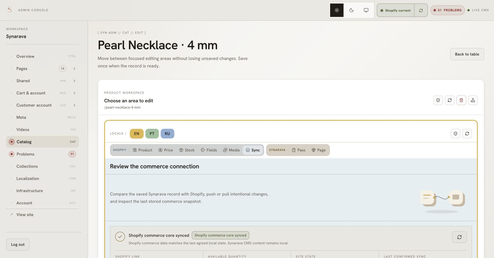

# Исправление синхронизации продукта с Shopify

Дата: 2026-10-04. Статус: завершено. Исправления в main и production; Pearl Necklace проверен после Push, повторного live check и reload — 0 конфликтов.

После каждого шага: сверить изменения с этим планом, записать результат проверки,
обновить оставшиеся шаги. Не считать тест с моками подтверждением работы живого магазина.

## Сообщённые сбои

- Pearl Necklace · 4 mm: 20 конфликтов продукта, 1 в Product и 19 в Fields.
- Push падает с `Collection membership REMOVE failed … Collection does not exist`.
- Стрелка Push в Catalog Conflicts сообщает `No supported fields for this language in that direction`.
- В модалке некоторые SEO-значения выглядят перепутанными между Synarava и Shopify.
- Сырые названия вроде `Metafield global.title_tag.value` непонятны.

## План и проверки

- [x] 1. Прочитать оба присланных списка и ошибки; найти пути сравнения, Push и модалки.
  - Graphify query/explain выполнены; полезных связей недостаточно, исследованы исходники.
  - Значительная часть списка — различия технических ID метаполей.
  - Shopify подтвердил смену модели коллекций: в 2026-07 запись через источники
    `collectionUpdate`; старые версии не видят коллекции с новыми возможностями.
  - В текущем checkout новый API уже применяется; скриншот содержит старую ошибку.
- [x] 2. Воспроизвести ложные конфликты и устаревшие источники коллекций тестами.
  - До исправления упали тест сравнения ID/пустого метаполя и два теста удаления.
- [x] 3. Исправить сравнение: общая нормализация, технические ID, пустые значения,
  понятные названия; сохранить реальные различия значений.
  - Целевые тесты проходят. Дополнительно исправлено identity-сопоставление
    при добавлении/удалении метаполей: сравнение теперь идёт по namespace/key.
- [x] 4. Исправить Push коллекций и метаполей.
  - Удаление теперь читает живой источник; исчезнувшая коллекция/источник — уже удалённое членство.
  - Проверить очистку custom-метаполей и размеры mutation batch; не затрагивать чужие namespaces.
- [x] 5. Исправить HTML и запись локальных SEO/описания в OUR snapshot.
  - Найдено разрушение HTML удалением `<`, `>` и `&` в Push продукта и переводов.
  - Save ранее не записывал описание и SEO в OUR; добавлен write-through.
  - Нужно проверить Pull → Save → Push, старые snapshots и сторону значений в модалке.
- [x] 6. Исправить стрелки Catalog Conflicts и смешанные наборы поддерживаемых/заблокированных полей.
  - Вместо пустого набора при заблокированном commerce открываются детали с полным Pull/Push.
  - Добавлены кнопки полного Pull/Push для смешанных наборов; нужны регрессионные тесты.
- [x] 7. Проверить происхождение Synarava/Shopify значений SEO на сервере и в UI;
  исключить устаревший snapshot или сохранённый translation divergence.
- [x] 8. Обновить документацию; проверить код, тесты, типы, браузер и доступный живой сценарий.
  - Первый прогон: 34 теста прошли (4 файла); есть прежние предупреждения React act.
  - TypeScript: `tsc --noEmit --incremental false` прошёл.
- [x] 9. Обновить Graphify, проверить итоговый diff и отправить завершённое исправление в origin/main.
- [x] 10. Подтвердить отсутствие конфликтов повторным live check и reload после отправки последних сохранённых правок.

## Ограничения и открытые вопросы

- Секретные файлы не читаются. Восстановленная сессия позволила выполнить Save,
  Push и повторное сравнение на живом Pearl Necklace.
- 04586bb6 подтверждён в production через Railway; GitHub CI прошёл.
- После первого Push обнаружены новые сохранённые локальные тексты; второй Push
  отправил текущую Synarava-версию. Финальный check/reload подтвердил 0 конфликтов.
- Проверен один живой продукт Pearl Necklace · 4 mm. Остальные продукты не
  разрешались массово; направление их реальных различий остаётся выбором редактора.
- Ветка: `codex/product-sync-current`.

## Источник Shopify

[Миграция на flexible collections](https://shopify.dev/docs/apps/build/product-merchandising/products-and-collections/migrate-to-flexible-collections).

## История сверок (состояния на момент каждого шага)

### Сверка после первых исправлений

Новые изменения не меняют направление колонок: Synarava берётся из local/OUR,
Shopify — из live remote. Обнаружен пропуск write-through SEO/описания на Save;
он способен показывать прежние локальные значения под правильной колонкой.
Дополнительно проверяется устаревший translation divergence.

### Сверка после метаполей и направления

Добавлен отдельный Push метаполей с batch по 25, очисткой custom и namespace/key
вместо одного key при удалении passport. Pull сохраняет HTML. Чтение деталей и
product preview теперь обновляет translation reconciliation перед показом значений,
а при ошибке обновления не выдаёт прежние значения за живые. Пользователь попросил
продолжать без завершённого входа в админку; живая проверка остаётся открытой.

### Сверка после расширенной проверки

519 тестов (83 файла) прошли, TypeScript прошёл, lint: 0 ошибок и 3 существующих
предупреждения зависимостей useEffect. Новые UI-тесты подтвердили scoped fallback
и доступность полного Pull/Push при смешанных полях. Дополнительно исправляются
каталоговая стрелка и запись согласованного EN native поля в OUR после resolve.

### Сверка после проверки повторного конфликта

EN source resolve теперь принимает согласованный путь в OUR и обновляет store slice.
Проверка resolve, чтения сторон и модалки: 48 тестов прошли; дополнительно 36 тестов
reconciliation прошли. Product-scoped reconciliation теперь выбирает только binding
этого продукта, вместо чтения subjects всего каталога. Документация commerce-sync
обновлена. Добавлена обработка очистки SEO и эквивалентности null/пустого override.

Живая сверка SEO именно Pearl Necklace остаётся незавершённой: доступная сессия
истекла. Автоматические проверки подтверждают происхождение колонок и исправление
устаревшего OUR на Save/resolve; перестановка колонок в коде не обнаружена.

### Сверка перед отправкой

Повторный прогон: 522 теста (83 файла) и TypeScript проходят. Подтверждено официальной
документацией Shopify: global.title_tag/description_tag — второе представление SEO.
Единая нормализация теперь оставляет native seo, если оно есть, чтобы одно изменение
не давало два конфликта; legacy-only поля продолжают сравниваться. Добавлен отдельный
тест. Маркер релиза обновлён до 0.3.4. Локальный Next build не запускается, поскольку
он автоматически загружает защищённые секретные файлы; сборка проверяется CI.

### Итог локальной проверки

- 523 теста / 83 файла проходили на этом этапе; после переноса на main — 551 / 84.
- TypeScript прошёл; lint — 0 ошибок, 3 прежних предупреждения useEffect.
- Проверены направления значения SEO на серверном read model и стороны UI.
- Проверены переходы blocked-only и mixed из каталога и language scope.
- Graphify update завершён: 16 276 nodes, 27 420 edges.
- `git diff --check` чистый; обнаружена устаревшая база; перенесение на актуальный origin/main выполняется.
- CI через gh недоступен: GitHub CLI не авторизован. Проверка build на CI ещё не подтверждена.
- Живое разрешение конфликтов Pearl Necklace и результат после deploy не подтверждены.

### Чеклист живой проверки после релиза

1. Войти в админку, открыть Pearl Necklace · 4 mm и Run conflict check.
2. Сверить SEO title/description в форме, модалке и Shopify Admin: Synarava слева,
   Shopify справа; один native SEO факт, без дубликатов global.*.
3. Убедиться, что ID метаполей и пустой wrist_fit не дают конфликтов.
4. Из каталога, Product и Fields открыть направление Push; при blocked commerce
   увидеть полный Pull/Push и явный whole-record scope.
5. Для намеренно выбранной стороны выполнить Push/Pull; подтвердить отсутствие
   Collection membership REMOVE failed, повторить check и сверить real values.
6. Проверить rich HTML, пустое custom-поле и SEO clear; убедиться, что resolve не
   возвращается после reload. Записать результат сюда; только затем закрыть живой пункт.

### Сверка с актуальным main

После fetch найдены 11 новых commits. OUR метаполя теперь identity-map namespace::key,
а per-locale overlays и защита несохранённой формы сохраняются. Дубликат исправления
коллекций отброшен в пользу main. Batch helper возвращает Shopify IDs для переводов.
Повторная проверка всех изменений и тестов выполняется на этой базе.

### Живая диагностика после восстановления сессии

Админка доступна. Pearl Necklace: модалка подтверждает 20 conflicts — 17 технических
ID, пустой wrist_fit, различие care и повреждённое описание. Сайт ещё показывает
старый код: raw Metafield labels и ID conflicts. Само описание уже содержит p…/p
вместо тегов; предотвращения нового повреждения недостаточно — нужно восстановить
содержимое продукта после релиза и повторно проверить. 547 тестов / 84 файла прошли
на актуальной базе; TypeScript прошёл, lint 0 ошибок / 3 прежних предупреждения.

### Уточнение коллекций и живого описания

Описание в форме Pearl Necklace имеет правильный rich HTML; испорчены OUR snapshot
и remote Shopify. Повторное Save после deploy обновит OUR, Push — remote.
При повторном review обнаружено: main исправил только fallback последнего выбора,
но не устаревший ID источника. Возвращена live-проверка удаления; multi-source
коллекция удаляет опустевший managed source через sourcesToDelete, не legacy API
(который для новых коллекций сообщает Collection does not exist). Добавлены
четыре регрессии; fallback единственного source сохранён согласно Shopify.
Первый релиз 1f23ade0 собирается; дополнение готовится отдельно.

### Проверка после первого deploy

Railway подтвердил ACTIVE/Deployment successful для 1f23ade0. Pearl Necklace
открыт на новом релизе: 20 → 2 conflicts, технические ID и пустое поле исчезли.
Save подтверждён через штатную форму; описание не менялось, OUR обновлён из
исходного rich HTML. Дополнение 04586bb6 отправлено в main; 551 тест / 84 файла
и TypeScript проходят, collection lint без замечаний. Живой Push выполняется
после deploy дополнения.

### Живой Push и повторная проверка

04586bb6 ACTIVE, Railway deployment successful. GitHub CI run 37194297100:
Success — Quality Gates и desktop/mobile smoke. Push Pearl Necklace выполнен
успешно; Care instructions обновился, HTML в Shopify восстановлен. UI сразу
показал 0 conflicts. Повторный live check обнаружил 3 новых локальных отличия:
описание «Designed for a neck fit…», material «Artificial pearls…», SEO description
без «approximately». Они отличаются от сохранённой формы, отправленной первым
Push. Пользователю задан вопрос о параллельном редактировании; повторная запись
этих изменений пока не выполнена. Не считать исчезновение badge окончательной
сверкой — записать итог следующего check.

### Итоговая живая сверка

Второй Push успешно отправил последние сохранённые данные Synarava. Повторный
live conflict check завершился с 0 конфликтов; reload сохранил это состояние.
Sync-панель подтвердила `Shopify commerce core synced`, последнее согласование
11:16:53 и remote updated 11:14:51. Shopify SEO description совпадает с формой
без «approximately», custom.material — `Artificial pearls / 316L stainless steel /
Jewellery beading wire`. HTML восстановлен первым Push и не повреждён вторым.
Стороны SEO проверены на реальном различии: Synarava слева совпадала с формой,
Shopify справа — с remote. Никакой перестановки колонок не требуется.

- Исходные 20 конфликтов: 17 технических ID, 1 пустое метаполе и 2 реальные разницы.
- Каталоговая стрелка Push открывает значения и whole-record действия без ошибки языка.
- Push с живого продукта проходит без Collection membership REMOVE error.
- 551 тест / 84 файла, TypeScript, целевой lint проходят (3 прежних hook warnings).
- Дополнительная сверка текста сообщения/коллекций: 16 тестов / 2 файла проходят.
- GitHub CI [37194297100](https://github.com/KrystsiaK/synarava-jewelry/actions/runs/37194297100)
  прошёл Quality Gates и desktop/mobile smoke; Railway 04586bb6 ACTIVE.
- Graphify обновлён; итоговый diff проверен, документация приведена к реализации.

